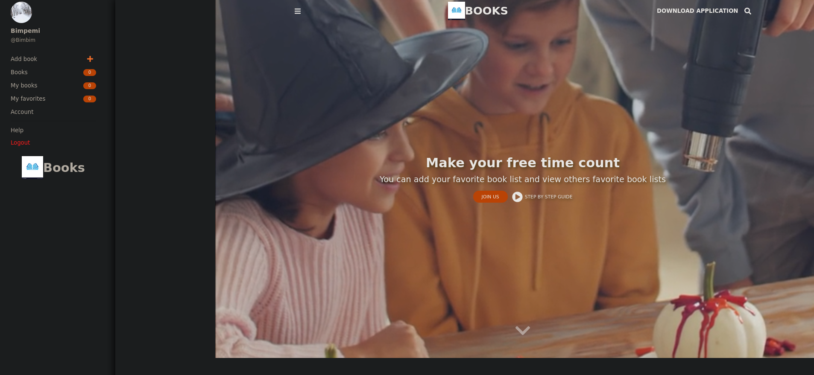

  

## Fav-Book

<!--
*** Thanks for checking out this README Template. If you have a suggestion that would
*** make this better, please fork the repo and create a pull request or simply open
*** an issue with the tag "enhancement".
*** Thanks again! Now go create something AMAZING! :D
-->

<!-- TABLE OF CONTENTS -->

## Table of Contents

- [About the Project](#about-the-project)
- [Contributors](#contributors)
- [Acknowledgements](#acknowledgements)
- [License](#license)

### About the Project

> The <b>Fav-Books</b> mobile web app presents the world's finest Favorite Books from all around the world. All users can create an account and add their favorite books, view/like other user's favorite books.
>  
> The APP is created with the latest industry standards using React.js and Redux Toolkit
>  
> API Backend used for data manipulation: [Rails FavBook-Api Backend](https://favbooks-api.herokuapp.com/)  
> The app is fully mobile responsive and tested using Jest and the React Testing Library.
>  

## App functionality

- Guests and users can view a catalog of books added by users.
- Logged in users can like/favorite books, this will automatically add the books to the favorite list and increase the like count for the book.
- Users can click on a book to be routed to the book show page where they can see extra details.
- All the data manipulation and login system is handled by a Rails Backend API

    

## Live Link (Heroku)

[Project live link](https://favbook-view.herokuapp.com/)

### Built With

This project was built using these technologies.

- React.js
- Redux Toolkit
- Axios
- devise_token_auth for login funtionality
- GitHub
- Heroku

### Testing

- Jest
- React Testing Library

## Getting Started

**To get this project set up on your local machine, follow these simple steps:**

**Step 1** 
Navigate through the local folder where you want to clone the repository and run 
`git clone https://github.com/jstloyal/fav-book`. It will clone the repo to your local folder. 
**Step 2** 
Run `cd 
fav-book ` 
**Step 3** 
Run `npm install` to install the npm packages from the `package.json` file. 
**Step 4** 
Run `npm start` to start the webpack server, you can now navigate to `http://localhost:3000` to view the app. The server refreshes the app every time you make a change to a file used by it. 
**Step 5** 
Most important, enjoy the app! 

## Tests

1. Open Terminal

2. Install dependencies (only if you did not install them previously):

   `npm install`

3. Run the tests with the command:

   `npm test`

## Contributors

**Author**

​**Adetayo Sunkanmi**

- Github: [jstloyal](https://github.com/jstloyal)
- Twitter: [@jstloyalty](https://twitter.com/jstloyalty)
- Linkedin: [Adetayo Sunkanmi](https://www.linkedin.com/in/jstloyalty)
- E-mail: jstloyalty@gmail.com

<!-- ACKNOWLEDGEMENTS -->

## Acknowledgements

- [Microverse](https://www.microverse.org/)

## License

📝
This project is [MIT](https://opensource.org/licenses/MIT) licensed.

## Show your support

If you've read this far....give us a ⭐️!
